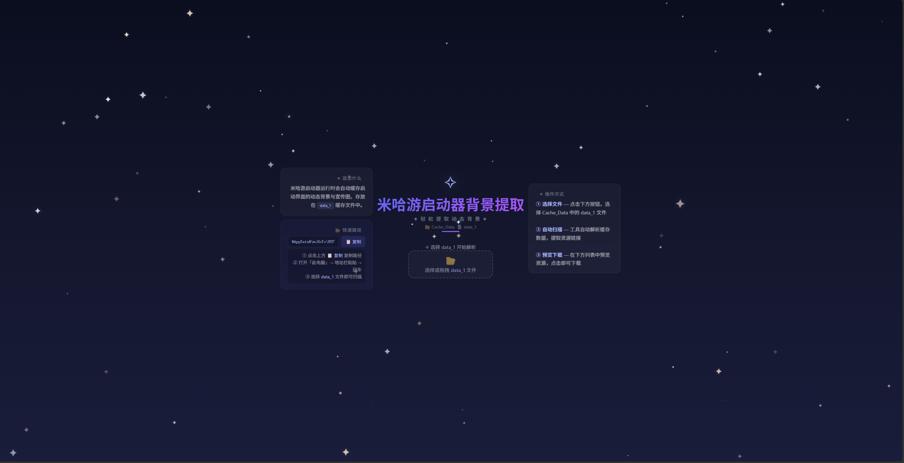

# ✧ 米哈游启动器背景提取器

一键提取米哈游启动器中的动态背景视频与宣传图片。

## 功能

- 🎬 提取启动器动态背景视频（.webm）
- 🖼️ 提取游戏宣传图片（.png/.jpg）
- 📄 扫描缓存配置文件
- ⚡ 拖拽上传或点击选择文件
- 📋 一键复制资源链接

## 使用方法

1. 打开米哈游启动器（让它加载过背景）
2. 进入缓存目录：
   ```
   %AppData%\miHoYo\HYP\1_1\fedata\Cache\Cache_Data
   ```
3. 选择 `data_1` 文件（可多选 `data_0`~`data_3`）
4. 等待扫描完成，即可预览和下载资源

## 在线使用

点击此链接使用：https://sophie92-spec.github.io/fictional-fortnight/

## 效果图



## 技术说明

- 纯前端 HTML/CSS/JavaScript
- 通过解析 Chromium Simple Cache 格式提取资源链接
- 星空背景 + 流星动画（纯 CSS）
- 所有处理在浏览器本地完成，不上传任何文件
